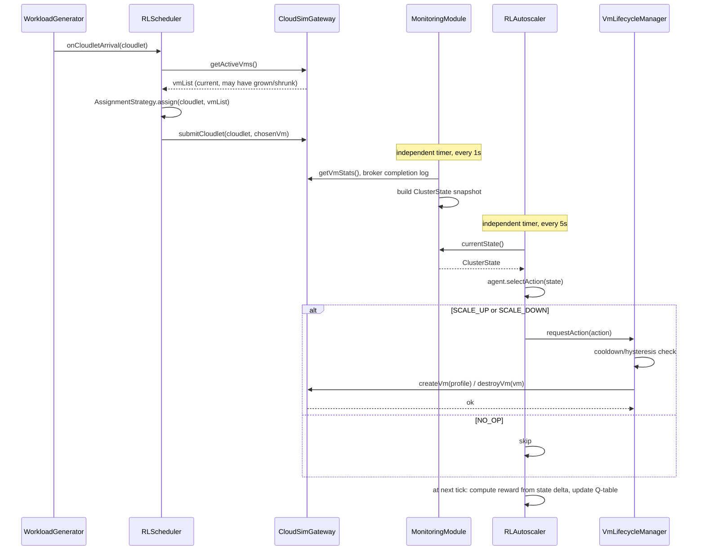

# RL-Based Cloud Resource Management System — Design Document

**Evolving a static CloudSim load-balancing comparator into an event-driven, dual-RL resource manager**

---

## 0. Assumptions & Scope Notes

- I assume you are on **CloudSim Plus** or a CloudSim variant that exposes `SimEntity`/event scheduling (`send()`, `schedule()`, `processEvent()`). If you're on classic CloudSim (Calheiros et al.), the design still holds — only the low-level VM-destruction and dynamic-submission calls inside the new `CloudSimGateway` class differ. I isolate all version-specific API calls behind that one class specifically so the rest of the system never has to change if you tell me which variant you're on.
- Your existing `AssignmentStrategy`, `RLStrategy`, `SimulationConfig`, `MetricsCalculator`, `ResultPrinter`, `SimulationRunner`, `Main` are treated as **frozen contracts**. Every new class either implements an existing interface, wraps an existing class, or sits beside it. Nothing is deleted in this design; some classes gain new *optional* methods/overloads.
- "Static mode" (your current benchmark comparisons of FCFS/RR/LL/Min-Min/Max-Min/SARSA(λ)) continues to work unchanged via a `SimulationMode.STATIC` config flag. The new behavior is `SimulationMode.DYNAMIC`.

---

## 1. System Architecture

```mermaid
flowchart TB
    subgraph Generation
        WG[WorkloadGenerator]
        AD[ArrivalDistribution\n+Poisson +Bursty +Trace]
    end

    subgraph Monitoring
        MM[MonitoringModule]
        CS[ClusterState\n(snapshot / sliding window)]
    end

    subgraph Control["RL Control Plane"]
        RLS[RLScheduler\n(wraps existing RLStrategy)]
        RLA[RLAutoscaler]
    end

    subgraph Infra["Infrastructure Control"]
        VLM[VmLifecycleManager]
        GW[CloudSimGateway]
    end

    subgraph CloudSimCore["CloudSim Core"]
        DC[Datacenter]
        BR[DynamicBroker]
        VMs[(VM Pool - heterogeneous)]
    end

    WG -- Cloudlet arrival event --> RLS
    AD --> WG
    RLS -- assign(cloudlet, vmList) --> GW
    GW --> BR --> DC --> VMs

    VMs -- utilization / queue / RT samples --> MM
    BR -- throughput / completion events --> MM
    MM --> CS
    CS -- state vector --> RLA
    CS -- optional augmented state --> RLS

    RLA -- ScaleUp/ScaleDown/NoOp --> VLM
    VLM --> GW

    MetricsCalc[MetricsCalculator\n(extended: windowed + final)] --> ResultPrinter
    MM -.periodic snapshot.-> MetricsCalc
```

**Key architectural decision:** neither `RLScheduler` nor `RLAutoscaler` talks to CloudSim directly. Both talk to `CloudSimGateway`. This is the single most important seam for (a) keeping your current classes stable, (b) isolating CloudSim-version differences, and (c) unit-testing the RL logic without spinning up a real simulation.

---

## 2. Module Responsibilities

| Module | Owns | Does NOT own |
|---|---|---|
| `WorkloadGenerator` | When cloudlets arrive, how many, how "bursty" | How they're assigned, VM state |
| `ArrivalDistribution` (interface + impls) | Inter-arrival time / batch-size math | Cloudlet content, RL logic |
| `MonitoringModule` | Sampling cadence, aggregating raw CloudSim state into `ClusterState` | Making decisions |
| `ClusterState` | Immutable snapshot / windowed metrics (data object) | Any behavior |
| `RLScheduler` | Adapting arrival events → calls into existing `RLStrategy`/`AssignmentStrategy` | VM lifecycle, infra cost |
| `RLAutoscaler` | Periodic scale decision (state→action via SARSA(λ)), reward bookkeeping | Actually creating/destroying VMs |
| `VmLifecycleManager` | Choosing *which* VM profile to add, *which* VM to evict, cooldown/hysteresis guards | Low-level CloudSim API calls |
| `CloudSimGateway` | All direct CloudSim API calls (submit cloudlet, create VM, destroy VM) | Any decision logic |
| `VmProfile` / `VmTemplate` | Heterogeneous VM specs (MIPS, RAM, BW, $/hr, watts) | — |
| `SlaPolicy` | SLA thresholds (max response time, etc.) | — |
| `AutoscalerRewardCalculator` | Composite reward for autoscaler | Scheduler reward (stays inside `RLStrategy`) |
| `SimulationConfig` (extended) | All new tunables below | — |
| `MetricsCalculator` (extended) | Adds windowed/streaming aggregation alongside existing final-summary aggregation | — |
| `SimulationRunner` (extended) | Chooses STATIC vs DYNAMIC bootstrapping path | — |

---

## 3. Class Diagram

```mermaid
classDiagram
    class AssignmentStrategy {
        <<interface>>
        +assign(cloudlet, vmList) Vm
    }
    class RLStrategy {
        SARSA(lambda) load balancer
        +assign(cloudlet, vmList) Vm
        +updateEligibilityTraces()
    }
    RLStrategy ..|> AssignmentStrategy

    class RLScheduler {
        -AssignmentStrategy strategy
        -CloudSimGateway gateway
        +onCloudletArrival(cloudlet)
    }
    RLScheduler --> AssignmentStrategy
    RLScheduler --> CloudSimGateway

    class WorkloadGenerator {
        -ArrivalDistribution distribution
        +scheduleNextArrival()
        +processEvent(SimEvent)
    }
    class ArrivalDistribution {
        <<interface>>
        +nextInterArrivalTime() double
        +nextBatchSize() int
    }
    class PoissonArrival
    class BurstyArrival
    class TraceBasedArrival
    ArrivalDistribution <|.. PoissonArrival
    ArrivalDistribution <|.. BurstyArrival
    ArrivalDistribution <|.. TraceBasedArrival
    WorkloadGenerator --> ArrivalDistribution
    WorkloadGenerator --> RLScheduler : fires arrival event

    class MonitoringModule {
        -int sampleIntervalSec
        -SlidingWindow window
        +tick()
        +currentState() ClusterState
    }
    class ClusterState {
        <<immutable>>
        +double avgCpuUtil
        +double avgQueueLength
        +double avgResponseTime
        +double throughput
        +int activeVmCount
        +double arrivalRate
        +double slaViolationRate
    }
    MonitoringModule --> ClusterState
    MonitoringModule --> CloudSimGateway : reads stats from

    class RLAutoscaler {
        -AbstractSarsaLambdaAgent agent
        -AutoscalerRewardCalculator rewardCalc
        -VmLifecycleManager vlm
        +tick()
        +chooseAction(ClusterState) AutoscalerAction
        +observeRewardAndUpdate()
    }
    class AutoscalerAction {
        <<enumeration>>
        SCALE_UP
        SCALE_DOWN
        NO_OP
    }
    class AbstractSarsaLambdaAgent {
        <<abstract, extracted from RLStrategy>>
        #Map~State,double~ qTable
        #Map~State,double~ eligibilityTraces
        +selectAction(state) Action
        +update(s,a,r,s2,a2)
    }
    RLStrategy --|> AbstractSarsaLambdaAgent : refactor target (phase 4)
    RLAutoscaler --> AbstractSarsaLambdaAgent
    RLAutoscaler --> AutoscalerAction
    RLAutoscaler --> ClusterState
    RLAutoscaler --> VmLifecycleManager

    class AutoscalerRewardCalculator {
        +computeReward(ClusterState before, ClusterState after, SlaPolicy) double
    }
    RLAutoscaler --> AutoscalerRewardCalculator
    AutoscalerRewardCalculator --> SlaPolicy

    class VmLifecycleManager {
        -List~VmProfile~ availableProfiles
        -CooldownPolicy cooldown
        +scaleUp() Vm
        +scaleDown() Vm
        +selectEvictionCandidate(vmList) Vm
    }
    VmLifecycleManager --> CloudSimGateway
    VmLifecycleManager --> VmProfile

    class CloudSimGateway {
        -DynamicBroker broker
        -Datacenter datacenter
        +submitCloudlet(cloudlet, vm)
        +createVm(VmProfile) Vm
        +destroyVm(Vm)
        +getActiveVms() List~Vm~
        +getVmStats(vm) VmSnapshot
    }
    class DynamicBroker {
        <<extends existing DatacenterBroker>>
        +submitCloudletDynamic(cloudlet)
        +submitVmDynamic(vm)
        +destroyVmDynamic(vm)
    }
    CloudSimGateway --> DynamicBroker

    class VmProfile {
        +String name
        +int mips
        +int ram
        +long bw
        +double costPerHour
        +double wattsIdle
        +double wattsBusy
    }

    class SlaPolicy {
        +double maxResponseTimeMs
        +double maxQueueLength
    }

    class MetricsCalculator {
        existing + windowed aggregation
    }
    class ResultPrinter {
        existing + scaling event log
    }
    class SimulationConfig {
        existing + arrival/autoscaler/vm-profile config
    }
    class SimulationRunner {
        +runStatic()
        +runDynamic()
    }
    SimulationRunner --> WorkloadGenerator
    SimulationRunner --> MonitoringModule
    SimulationRunner --> RLAutoscaler
    SimulationRunner --> RLScheduler
    SimulationRunner --> CloudSimGateway
    MonitoringModule --> MetricsCalculator : periodic push
    ResultPrinter --> MetricsCalculator
```



**New classes:** `WorkloadGenerator`, `ArrivalDistribution` (+3 impls), `MonitoringModule`, `ClusterState`, `RLScheduler`, `RLAutoscaler`, `AutoscalerAction`, `AutoscalerRewardCalculator`, `VmLifecycleManager`, `CloudSimGateway`, `DynamicBroker`, `VmProfile`, `SlaPolicy`, `AbstractSarsaLambdaAgent` (extraction).

**Modified classes:** `SimulationConfig` (new sections), `SimulationRunner` (new `runDynamic()` path), `MetricsCalculator` (windowed aggregation added, existing methods untouched), `ResultPrinter` (new log lines for scaling events), `RLStrategy` (optional refactor in phase 4 to extend `AbstractSarsaLambdaAgent` — behavior-preserving).

**Untouched:** `AssignmentStrategy`, `Main` (gets one new CLI/config flag), all heuristic strategies (FCFS/RR/LL/Min-Min/Max-Min).

---

## 4. Data Flow — Step by Step

1. **Bootstrap** (`SimulationRunner.runDynamic()`): reads `SimulationConfig`, builds initial heterogeneous VM pool via `VmProfile` list, wires `CloudSimGateway` around the `DynamicBroker`/`Datacenter`, constructs `RLScheduler`, `RLAutoscaler`, `MonitoringModule`, `WorkloadGenerator`, and schedules their first `SimEvent`s.
2. **Arrival**: `WorkloadGenerator.processEvent()` fires on its self-scheduled timer, creates one or more `Cloudlet`s (size/length drawn from config, batch size from `ArrivalDistribution` — bursts = large batch, idle = long inter-arrival gap), then invokes `RLScheduler.onCloudletArrival(cloudlet)`, and immediately schedules its *own next* arrival event (this is what makes it "event-driven" rather than a pre-generated list).
3. **Scheduling**: `RLScheduler` asks `CloudSimGateway.getActiveVms()` for the current (possibly just-changed) VM list, calls the **existing** `AssignmentStrategy.assign(cloudlet, vmList)` (your `RLStrategy` or any heuristic), then calls `gateway.submitCloudlet(cloudlet, chosenVm)`. This is the only place your existing SARSA(λ) load-balancing code is touched — it now simply gets called once per arrival event instead of once per item in a pre-built loop, with an *unbounded, time-varying* VM list.
4. **Monitoring**: `MonitoringModule.tick()` fires on its own fixed timer (e.g. every 1s), pulls live stats from `CloudSimGateway.getVmStats()` and broker completion events, folds them into a `SlidingWindow`, and produces an immutable `ClusterState` snapshot. It also pushes a windowed summary into `MetricsCalculator` so your existing reporting pipeline gets continuous data instead of only end-of-run data.
5. **Autoscaling**: `RLAutoscaler.tick()` fires every `autoscaler.intervalSec` (config, default 5s). It reads the latest `ClusterState`, encodes it into a discretized state, selects an action via its SARSA(λ) agent, and — critically — **does not act directly**: it delegates to `VmLifecycleManager`, which applies cooldown/hysteresis rules (avoid flapping) and, if approved, calls `CloudSimGateway.createVm(...)` or `.destroyVm(...)`.
6. **Reward loop**: at the *next* autoscaler tick, `RLAutoscaler` compares the `ClusterState` captured just before the previous action to the one captured now, asks `AutoscalerRewardCalculator.computeReward(before, after, slaPolicy)` for a scalar reward, and performs the SARSA(λ) update (`Q(s,a) ← Q(s,a) + α[r + γQ(s',a') − Q(s,a)]`, with eligibility trace decay). This is the same update rule shape as your existing scheduler — that's why extracting `AbstractSarsaLambdaAgent` is valuable (see §9).
7. **Completion**: `DynamicBroker` receives cloudlet-return events from CloudSim as normal; it forwards completion info to `MonitoringModule` (for response time / throughput) and to `MetricsCalculator` (for final summary stats), exactly as your current pipeline already does at the end of a static run — just incrementally now.
8. **Termination**: `WorkloadGenerator` stops scheduling new arrivals after `simulation.durationSec` (or after a configured total cloudlet count); `SimulationRunner` waits for CloudSim's event queue to drain, then calls the existing `ResultPrinter` (extended with a scaling-event log and windowed-metric charts/tables) exactly as today.

---

## 5. Where CloudSim Must Be Extended

| Need | Extension |
|---|---|
| Submit cloudlets *during* the run, not all up-front | `DynamicBroker extends DatacenterBroker` overriding/adding `submitCloudletDynamic()` which calls `submitCloudletList(singletonList)` from inside a `processEvent()` handler rather than once in `startEntity()` |
| Create VMs mid-run | `DynamicBroker.submitVmDynamic(Vm)` → `submitVmList(singletonList)` triggered by an internal `SimEvent`, or (CloudSim Plus) `broker.submitVm(vm)` after `datacenter0.getVmAllocationPolicy()` capacity check |
| Destroy VMs mid-run | CloudSim Plus: `vm.getHost().destroyVm(vm)` + remove from broker's tracked list. Classic CloudSim: send `CloudSimTags.VM_DESTROY` event to the datacenter and clean up broker-side lists manually — this is the one part of classic CloudSim that needs the most careful custom code, all contained in `CloudSimGateway.destroyVm()` |
| Periodic self-ticking components (`WorkloadGenerator`, `MonitoringModule`, `RLAutoscaler`) | Each becomes (or wraps) a `SimEntity`. Standard pattern: `startEntity()` calls `schedule(getId(), delay, TICK_TAG)`; `processEvent()` handles `TICK_TAG` by doing its work and re-scheduling itself — this is what turns "run to completion in a for-loop" into genuinely event-driven simulation |
| Energy accounting | If using CloudSim Plus, hook `PowerModel`/`PowerMeter` per host; otherwise implement a small `EnergyModel` inside `VmProfile` (idle/busy watts × elapsed time), sampled by `MonitoringModule` |
| Cost accounting | CloudSim Plus has `VmCost`/`CloudletCost` utilities; otherwise `VmProfile.costPerHour × uptime`, accumulated in `MonitoringModule` |
| Heterogeneous VM creation | `VmProfile` catalog + `VmLifecycleManager` picks a profile per scale-up (round-robin, cheapest-that-fits, or itself a small learned/heuristic policy — phase 5 stretch) |

**Nothing about `Datacenter`'s internal scheduling policy needs to change** — you're extending the *broker* and adding new *SimEntities* around it, not modifying CloudSim's core resource allocation engine.

---

## 6. How the Simulation Loop Changes

**Before (static, current code):**
```
build all VMs
build all cloudlets
for each cloudlet: strategy.assign(cloudlet, vmList)
submit full cloudlet list to broker
CloudSim.startSimulation()   // runs to completion in one shot
compute final metrics
print results
```

**After (dynamic):**
```
build initial VM pool (heterogeneous, via VmProfile)
construct WorkloadGenerator, MonitoringModule, RLAutoscaler, RLScheduler
each schedules its own first SimEvent (arrival tick / monitor tick / autoscale tick)
CloudSim.startSimulation()
   → event queue now interleaves:
       - cloudlet arrival events  (→ RLScheduler → assign+submit)
       - cloudlet completion events (→ MonitoringModule, MetricsCalculator)
       - monitor tick events      (→ ClusterState snapshot)
       - autoscale tick events    (→ RLAutoscaler decide/act/learn)
   → each handler re-schedules its own next event until simulation.durationSec reached
CloudSim drains remaining events, simulation ends naturally
compute final + windowed metrics
print results (existing ResultPrinter + new scaling-event log)
```

The critical shift: **CloudSim's own future-event-list becomes the driver.** You no longer control iteration with a Java `for`/`while` loop over a pre-built list — you control it by what each `SimEntity` chooses to schedule next. `SimulationRunner` becomes a *bootstrapper*, not a loop.

---

## 7. Scheduler ↔ Autoscaler Interaction

They are **decoupled through `ClusterState` and `CloudSimGateway` only** — they never call each other directly. This matters for both software-engineering cleanliness and RL correctness (each agent has its own state/action/reward loop and shouldn't be tangled with the other's).



The only *implicit* coupling is real, not architectural: when the autoscaler adds/removes a VM, the very next `RLScheduler.assign()` call sees a different `vmList` because it re-fetches from `CloudSimGateway` on every arrival — it never caches VM lists. That's the one rule to enforce carefully in the scheduler wrapper.

---

## 8. State / Action / Reward Definitions

### 8.1 RL Scheduler (reused — no change to your existing definitions)
Kept exactly as implemented in `RLStrategy` today. Optional (phase 5, non-breaking) enhancement: augment the existing per-cloudlet state features with `ClusterState.arrivalRate` and `ClusterState.avgQueueLength` for better decisions under bursty load — additive, backward compatible if guarded by a config flag.

### 8.2 RL Autoscaler (new)

**State** (from `ClusterState`, discretized into bins for tabular SARSA(λ), consistent with your scheduler's tabular approach):
| Feature | Description | Example binning |
|---|---|---|
| `avgCpuUtil` | Mean CPU utilization across active VMs | LOW / MED / HIGH / CRITICAL |
| `avgQueueLength` | Mean pending-task queue length per VM | 0 / 1-3 / 4-10 / 10+ |
| `arrivalRate` | Smoothed incoming requests/sec | LOW / MED / HIGH / SPIKE |
| `avgResponseTime` | Windowed mean response time vs SLA threshold | UNDER / NEAR / OVER |
| `activeVmCount` | Normalized (current / max configured) | LOW / MED / HIGH |
| `slaViolationRate` | Fraction of requests breaching SLA in window | 0 / LOW / HIGH |

**Action space:**
- `SCALE_UP` — add one VM (profile chosen by `VmLifecycleManager`, default policy: cheapest profile meeting a headroom target; pluggable like `AssignmentStrategy`)
- `SCALE_DOWN` — remove one VM (`VmLifecycleManager` picks the least-loaded VM, drains its queue first — no killing mid-execution cloudlets)
- `NO_OP` — do nothing

**Reward** (computed at each tick, comparing state-before vs state-after the *previous* action — standard delayed-reward pattern for infra actions):

```
R = -w1 * normalizedResponseTime
    -w2 * slaViolationPenalty
    +w3 * utilizationFitness         // peak near target band, e.g. 60-80%, penalized both under and over
    -w4 * energyCost                  // from VmProfile watts * elapsed time
    -w5 * infrastructureCost          // from VmProfile $/hr * elapsed time
```
Weights (`w1..w5`) live in `SimulationConfig` as tunables — this lets you run ablations (e.g. cost-optimized vs SLA-optimized policies) without touching code, mirroring how your existing project already exposes strategy comparisons.

`utilizationFitness` deliberately uses a *target band* rather than "maximize utilization," because pure maximization would train the agent to run VMs red-hot and blow SLAs; a band centered around 60–80% is a standard, defensible choice worth stating explicitly in your thesis/report if this is academic work.

---

## 9. Reducing Duplication Between the Two RL Agents

Both `RLStrategy` (scheduler) and `RLAutoscaler` use SARSA(λ): a Q-table, eligibility traces, ε-greedy action selection, TD(λ) updates. Rather than writing a second, parallel implementation of that math, **phase 4** extracts the shared mechanics into `AbstractSarsaLambdaAgent`, and `RLStrategy` is refactored to extend it (behavior-preserving — same hyperparameters, same update rule, just relocated). `RLAutoscaler` then holds its own instance of a (smaller) agent, with its own state/action space and reward. This is optional but strongly recommended: it satisfies your "reuse existing classes" requirement literally, and it means any bug fix or tuning improvement to the SARSA(λ) core benefits both agents at once.

If you'd rather not touch `RLStrategy` at all, the fallback is: `RLAutoscaler` gets its own small, independent SARSA(λ) implementation, duplicated but isolated. Either is compatible with the rest of this design — the extraction is a quality improvement, not a hard dependency.

---

## 10. Example Simulation Timeline

```
t=0s      Datacenter + initial 4 heterogeneous VMs created. WorkloadGenerator, MonitoringModule,
          RLAutoscaler all schedule their first tick.
t=0-30s   Light traffic (Poisson, low rate). RLScheduler assigns tasks to the 4 VMs. Utilization ~30%.
t=5s,10s..  Autoscaler ticks: state=LOW util → NO_OP (or SCALE_DOWN once cooldown allows, if idle persists).
t=30s     BurstyArrival injects a spike: 50 cloudlets arrive within 2s.
t=32s     MonitoringModule reflects rising queue length / utilization on next tick.
t=35s     Autoscaler tick: state=HIGH util, HIGH queue → SCALE_UP. VmLifecycleManager creates 1 new VM
          (profile chosen for the observed load), CloudSimGateway registers it with DynamicBroker.
t=40s     Autoscaler tick: reward computed from t=35 state vs t=40 state (response time improved) →
          positive reward → Q-table updated, reinforcing SCALE_UP under this state pattern.
t=60-120s Traffic subsides (idle period). Utilization drifts down.
t=125s    Autoscaler observes LOW util + LOW queue sustained past cooldown window → SCALE_DOWN,
          VmLifecycleManager selects the least-loaded VM, drains it, CloudSimGateway destroys it.
t=180s    Simulation duration reached. WorkloadGenerator stops scheduling new arrivals.
t=180s+   CloudSim drains remaining in-flight cloudlets naturally.
t=end     MetricsCalculator finalizes (existing summary + new windowed time-series), ResultPrinter
          prints existing report plus scaling-event log (timestamp, action, resulting VM count, reward).
```

---

## 11. Configuration Additions (`SimulationConfig`)

All additive — no existing fields removed or renamed.

```
simulation.mode = STATIC | DYNAMIC
simulation.durationSec = 300

workload.arrivalDistribution = POISSON | BURSTY | TRACE
workload.meanArrivalRate = 5.0          // tasks/sec
workload.burstProbability = 0.05
workload.burstSizeRange = [20, 60]

monitoring.sampleIntervalSec = 1
monitoring.windowSizeSec = 10

autoscaler.intervalSec = 5
autoscaler.cooldownSec = 15
autoscaler.minVms = 2
autoscaler.maxVms = 20
autoscaler.utilTargetLow = 0.6
autoscaler.utilTargetHigh = 0.8
autoscaler.rewardWeights = { responseTime: 0.3, sla: 0.3, utilization: 0.2, energy: 0.1, cost: 0.1 }

vmProfiles = [ {name: small, mips: 1000, ram: 512, costPerHour: 0.02, wattsIdle: 50, wattsBusy: 120},
               {name: medium, mips: 2000, ram: 1024, costPerHour: 0.05, wattsIdle: 60, wattsBusy: 180},
               {name: large, mips: 4000, ram: 2048, costPerHour: 0.10, wattsIdle: 80, wattsBusy: 250} ]

sla.maxResponseTimeMs = 2000
sla.maxQueueLength = 10
```

---

## 12. Class Ownership Summary (quick reference)

| Concern | Owning class |
|---|---|
| "When does a task arrive?" | `WorkloadGenerator` / `ArrivalDistribution` |
| "Which VM gets this task?" | `AssignmentStrategy` impl, invoked by `RLScheduler` |
| "What's the current system health?" | `MonitoringModule` → `ClusterState` |
| "Should we scale?" | `RLAutoscaler` |
| "How exactly do we scale (which profile, which victim, is it safe right now)?" | `VmLifecycleManager` |
| "How do we talk to CloudSim?" | `CloudSimGateway` (+ `DynamicBroker`) |
| "Is this a good outcome?" (scheduler) | inside existing `RLStrategy` |
| "Is this a good outcome?" (autoscaler) | `AutoscalerRewardCalculator` |
| "What are our SLA/target thresholds?" | `SlaPolicy`, `SimulationConfig` |
| "What did we record / how do we report it?" | `MetricsCalculator`, `ResultPrinter` (both extended, not replaced) |

---

## 13. Incremental Implementation Roadmap

Each phase is independently runnable and leaves `STATIC` mode fully intact.

| Phase | Goal | New/changed classes | Risk |
|---|---|---|---|
| **0** | Groundwork, zero behavior change | Add `SimulationMode` enum to `SimulationConfig`; add empty `runDynamic()` stub to `SimulationRunner` that just calls `runStatic()` for now | None |
| **1** | Event-driven arrivals only (fixed VM pool, existing scheduler) | `WorkloadGenerator`, `ArrivalDistribution` (+`PoissonArrival` first), `RLScheduler` (thin wrapper), `CloudSimGateway` (submit-only subset), `DynamicBroker` (dynamic cloudlet submission only) | Low — validates event-driven mechanics with your existing, already-tested `RLStrategy` |
| **2** | Observability | `MonitoringModule`, `ClusterState`, `MetricsCalculator` windowed extension | Low — pure read-side, no control-flow risk |
| **3** | Manual/heuristic autoscaling first | `VmProfile`, `SlaPolicy`, `VmLifecycleManager`, `CloudSimGateway` (add VM create/destroy), a simple **threshold-based** autoscaler (not RL yet) implementing the same tick interface `RLAutoscaler` will use | Medium — this is where CloudSim VM-destruction quirks surface; isolate and stabilize before adding RL on top |
| **4** | Replace heuristic autoscaler with RL | `RLAutoscaler`, `AutoscalerAction`, `AutoscalerRewardCalculator`, optional `AbstractSarsaLambdaAgent` extraction from `RLStrategy` | Medium — new learning loop, but infra plumbing already proven in phase 3 |
| **5** | Realism: bursts, heterogeneity tuning, idle periods, reward-weight ablations | `BurstyArrival`, `TraceBasedArrival`, expanded `VmProfile` catalog, config-driven weight sweeps | Low — mostly config/data, not architecture |
| **6** | Experiment matrix & reporting | `ResultPrinter` scaling-event log, comparison tables (heuristic-scheduler+heuristic-scaler vs RL+RL vs mixed) | Low |

At every phase boundary, your existing static benchmark suite (FCFS/RR/LL/Min-Min/Max-Min/SARSA(λ)) should still run and produce identical output to today — that's the regression check that confirms nothing was broken.

---


